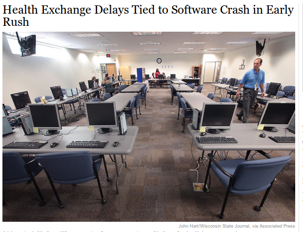
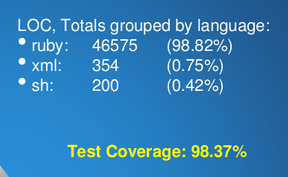

##Agenda
* Rant, rave, make dramatic hand gestures
* Calmly test drive something
* Instruct where to learn more

---

<aside class="notes">
When I have to be, I'm this kind of zealot.
</aside>


###Disclaimer: I am a testing zealot

---
<aside class="notes">
But I much prefer to be this kind of a zealot. I really enjoy testing and it puts me in a good place when I'm developing.
</aside>

##"We're going TESTING!"


###Disclaimer: I am a testing zealot

---

<aside class="notes">
<ul>
<li>
TDD and BDD are too similar to swear allegiance to one or the other. Pick one that you like and move on with your life. 
<li>
If you sit down with someone who loves a particular framework, use it!
</ul>
</aside>
  
##Testing Guidelines


* TDD and BDD: don't discriminate

---
<aside class="notes">
<ul>
<li>
This one is where I am rightly called a zealot. There are many people who test last. Some of them may even do it successfully.
<li>
Sandi Metz says that software is built for reuse and the first use of your software is your tests.
<li>
The only way to ensure safety _and_ quality of design (think Sandi Metz and Bob Martin) is to test first.
</ul>
</aside>

##Testing Guidelines

* Test First > Test Last
* WWSMD?


---
<aside class="notes">
<ul>
<li>
This one I'm serious about. Our industry is starving for developers. We need them so badly that we'll take average talent, average effort and we'll even pay a lot for it. What we're left with is average products that fail in spectacular and unanticiapated ways.
</ul>
</aside>

##Testing Guidelines

* You Should Only Learn to Test Drive if You Want to Be a *Good* Developer

---
<aside class="notes">
<ul>
<li>
Here's the most recent example, and I'm sure some of you have been following this. The Federal government hired a team of contractors to develop healthcare.gov. The results were disasterous.
<li>
The site falls over under heavy load
<li>
It forgets users that regsitered before Oct 1
<li>
Users are prevented from creating new accounts for no reason.
<li>
Users received a registration email with a broken link in it.
<li>
I'd bet a large amount of money that this site was not test driven. It's easy to lampoon the developers without realizing the truth: this can happen to _anybody_. These bugs _have_ happened to everybody. This can happen to me tomorrow if I don't stick to the fundamentals. 
</ul>
</aside>

##Careless Implementation Hits Home



---
<aside class="notes">
<ul>
<li>
You can join the ranks of the mediocre easily. It's a low bar to cross. But if you aspire to better, and I know everyone here does, you have to test drive. I am an easy-going guy but I don't compromise on this. 

<li>
Everyone here is a developer. The only question is whether you're going to be any good at it.
<li>
Not on personal projects, not when I'm pairing, and not during interviews. There's too much at stake.
<li>
End users of web applications (everybody) deserve better than they have now. They deserve quality, craftsmanship, attention to detail. This is how you give it to them.
</ul>
</aside>

##Aspire to be Better


---

## `</rant>`

---
<aside class="notes">
<ul>
<li>
This project was a pleasure to work on.
<li>
We released whenever we wanted. 
<li>
Bugs were found and fixed in seconds
</ul>
</aside>

##What Does Good Testing Look Like?



---

##How Do I Get Started?

---
<aside class="notes">
<ul>
<li>
3 steps to getting started with rspec in your rails app.
</ul>
</aside>

##How to Get Up and Running
* Skip the test/ dirs with `rails new $app_name -skip-test-unit`
* Add `gem 'rspec-rails'`, `gem 'capybara'` to Gemfile
* `rake generate rspec:install`

```
    joe@warpaint:~/dev/ga/temp/slacker$ rails generate rspec:install
          create  .rspec
          create  spec
          create  spec/spec_helper.rb
```

---

##Alternative
* [rails composer](http://railsapps.github.io/rails-composer/)
* `rails new myapp -m https://raw.github.com/RailsApps/rails-composer/master/composer.rb`
* Select server, database, template engine, test framework, and more

---

##GTWR

---

##Test Driving
###Test Outside-In

---

##Test Driving
###Know What Your Are Testing

* Unit vs. Integration Specs

---


##Test Driving
###Start with the Expectations

---

##Test Driving
###Make Your Specs Fail for the Right Reason

---

##Test Driving
###Write the Least Amount of Code to Pass the Spec

---

##Test Driving
###Practice Ping Pong Pairing

---

##What did we learn?

* Test first isn't easy and it's not always fast
* Let the code guide you, not the browser
* There's _so_ much to learn

---

##Great Frameworks in Testing

* RSpec
* MiniTest
* Jasmine
* Capybara

---

##Great Minds in Testing

* Brian Marick
* Nat Pryce
* Steve Freeman
* Roy Osherove
* Dave Thomas
* Kent Beck
* Bob Martin
* David Chelimsky

---
##Great Texts in Testing

* [Growing Object Oriented Software, Guided by Tests](http://www.amazon.com/Growing-Object-Oriented-Software-Guided-Tests/dp/0321503627) (the "GOOS" book)

  * Nat Pryce and Steve Freeman
* [xUnit Test Patterns: Refactoring Test Code](http://www.amazon.com/xUnit-Test-Patterns-Refactoring-Code/dp/0131495054/ref=sr_1_1?s=books&ie=UTF8&qid=1381193288&sr=1-1&keywords=xunit+test+patterns+refactoring+test+code)
  * Roy Osherove

